<div align="center">

# 🌃 午夜酒馆 · MIDNIGHT TAVERN

### 人格化娱乐宇宙 · V1 房间「Poker Egg 人格牌桌」营业中

[](README_EN.md)
[](README.md)

[](https://github.com/)
[](LICENSE)
[](https://reactjs.org/)
[](https://fastapi.tiangolo.com/)
[](https://github.com/)

**Read your opponent. Read yourself.**

**你的弃牌率，比你更懂你。**

⚠️ *本项目仅用于 AI 行为模拟演示，不涉及真实货币博弈。所有对局均为虚拟筹码，所有行为数据仅用于人格建模研究。*

</div>

---

## 🔮 这是什么

**午夜酒馆不是一个游戏 Demo——它是一座正在生长的人格化娱乐宇宙。**

酒馆里每个房间都住着同一套引擎：**人格建模 + 决策数学**。扑克、调酒、音乐，只是同一颗人格内核披上不同场景的外衣。

推开酒馆大门，黑胶唱片在转，霓虹在杯壁上反光。第一个房间「Poker Egg 人格牌桌」已经开业——你坐下的这张牌桌，对面不是冷冰冰的随机数 AI，而是 **16 种 MBTI 人格驱动的虚拟对手**：

- **紫人（NF）** 用 62%~66% 的诈唬频率诱你上钩
- **黄人（NT）** 以 87%~89% 的抗噪能力冷静读牌
- **蓝人（SJ）** 用 72%~83% 的弃牌率构筑铜墙铁壁
- **绿人（SP）** 以 66%~81% 的激进度穷追猛打

每一次 all-in、每一次弃牌、每一次被诈唬，都是一次人格照镜子。它不是在教你打牌，而是在教你看清自己。

---

## 🧠 图 1：三层 AI 架构（核心）

```mermaid
%%{init: {'theme': 'dark', 'themeVariables': {
  'background': '#0a080c',
  'primaryColor': '#A78BFA',
  'primaryBorderColor': '#A78BFA',
  'primaryTextColor': '#d4c0a8',
  'secondaryColor': '#1a1420',
  'tertiaryColor': '#0e0b10',
  'lineColor': '#3a2a30'
}}}%%
graph TB
    subgraph performer["🎭 表演层 Performer"]
        P1["可选 LLM 驱动<br>人格化台词 · 嘲讽 · 情绪反应"]:::performer
        P2["关闭即退化为纯行为人格<br>毫秒级响应"]:::performer
    end

    subgraph persona["🎴 人格层 Persona"]
        PA["PersonaPokerMapper<br>8 维人格参数 × 12 维行为模型"]:::persona
        PB["bluffFreq · tiltResist · noiseResist"]:::persona
        PC["人格化决策理由 + tilt 情绪记忆"]:::persona
    end

    subgraph math["📐 数学层 Mathematics"]
        M1["Kelly Criterion<br>实时最优投注比例"]:::math
        M2["蒙特卡洛真胜率<br>逐街重算（翻牌/转牌/河牌）"]:::math
        M3["Game-OS 风控三阈值<br>0.48 保本 / 0.50 稳态 / 0.68 熔断"]:::math
    end

    subgraph engine["🃏 Poker Game Engine"]
        E["preflop → flop → turn → river → showdown"]:::engine
    end

    math --> engine
    persona --> engine
    performer --> engine

    classDef performer fill:#2a1a3a,stroke:#F472B6,stroke-width:2px,color:#F9A8D4;
    classDef persona fill:#1a1a3a,stroke:#A78BFA,stroke-width:2px,color:#d4c0a8;
    classDef math fill:#1a2a3a,stroke:#22D3EE,stroke-width:2px,color:#67E8F9;
    classDef engine fill:#1a1a2a,stroke:#FBBF24,stroke-width:2px,color:#FCD34D;

    style performer fill:#0a080c,stroke:#F472B6,stroke-width:1px
    style persona fill:#0a080c,stroke:#A78BFA,stroke-width:1px
    style math fill:#0a080c,stroke:#22D3EE,stroke-width:1px
    style engine fill:#0a080c,stroke:#FBBF24,stroke-width:1px
```



---

## 🎭 图 2：四大气质组 · 16 型人格阵容

```mermaid
%%{init: {'theme': 'dark', 'themeVariables': {
  'background': '#0a080c',
  'primaryColor': '#A78BFA',
  'primaryBorderColor': '#A78BFA',
  'primaryTextColor': '#d4c0a8',
  'secondaryColor': '#1a1420',
  'tertiaryColor': '#0e0b10',
  'lineColor': '#3a2a30'
}}}%%
graph TB
    subgraph nf["🔮 NF · 诗意弈者 The Dreamers"]
        NF1["INFP · INFJ · ENFP · ENFJ<br>bluff 62%~66% · 情绪驱动<br>读心者与叙事家"]:::nf
    end

    subgraph nt["🧪 NT · 算度大师 The Analysts"]
        NT1["INTP · INTJ · ENTP · ENTJ<br>noiseResist 87%~89% · 情绪绝缘<br>冷酷的概率机器"]:::nt
    end

    subgraph sj["🛡️ SJ · 阵地守将 The Guardians"]
        SJ1["ISTJ · ISFJ · ESTJ · ESFJ<br>fold 72%~83% · 极紧 · 风险厌恶<br>铜墙铁壁"]:::sj
    end

    subgraph sp["⚡ SP · 战术猎手 The Explorers"]
        SP1["ISTP · ISFP · ESTP · ESFP<br>aggr 66%~81% · 松凶 · 即兴进攻<br>牌桌上的野兽"]:::sp
    end

    nf --> nt --> sj --> sp

    classDef nf fill:#2a1a3a,stroke:#A78BFA,stroke-width:2px,color:#A78BFA;
    classDef nt fill:#2a2a1a,stroke:#FBBF24,stroke-width:2px,color:#FBBF24;
    classDef sj fill:#1a2a3a,stroke:#22D3EE,stroke-width:2px,color:#22D3EE;
    classDef sp fill:#1a2a1a,stroke:#34D399,stroke-width:2px,color:#34D399;

    style nf fill:#0a080c,stroke:#A78BFA,stroke-width:1px
    style nt fill:#0a080c,stroke:#FBBF24,stroke-width:1px
    style sj fill:#0a080c,stroke:#22D3EE,stroke-width:1px
    style sp fill:#0a080c,stroke:#34D399,stroke-width:1px
```



---

## 🏗️ 图 3：系统架构全景

```mermaid
%%{init: {'theme': 'dark', 'themeVariables': {
  'background': '#0a080c',
  'primaryColor': '#A78BFA',
  'primaryBorderColor': '#A78BFA',
  'primaryTextColor': '#d4c0a8',
  'secondaryColor': '#1a1420',
  'tertiaryColor': '#0e0b10',
  'lineColor': '#3a2a30'
}}}%%
graph TB
    subgraph frontend["🖥️ 前端 React 18 + Vite"]
        F1["PokerTable<br>牌桌布局"]:::front
        F2["MidnightTavern<br>酒馆氛围层"]:::front
        F3["AnalysisPanel<br>Kelly 风控面板"]:::front
        F4["SideDrawer<br>六维数据区"]:::front
        F5["Zustand 状态管理<br>+ Framer Motion 动画"]:::front
    end

    subgraph backend["⚙️ 后端 FastAPI"]
        B1["WebSocket<br>实时牌桌通信"]:::back
        B2["ai_engine<br>数学层 EV/Kelly/蒙特卡洛"]:::back
        B3["personality_engine<br>人格层 · 16 型配置"]:::back
        B4["JWT 认证<br>用户系统"]:::back
    end

    subgraph storage["💾 存储层"]
        S1["PostgreSQL<br>（可选，自动降级内存）"]:::storage
        S2["localStorage<br>前端战绩持久化"]:::storage
    end

    subgraph deploy["🚀 部署"]
        D1["GitHub Pages<br>前端托管"]:::deploy
        D2["Railway<br>后端容器"]:::deploy
    end

    frontend --> backend
    backend --> storage
    backend --> deploy

    classDef front fill:#1a1a3a,stroke:#A78BFA,stroke-width:2px,color:#d4c0a8;
    classDef back fill:#1a2a3a,stroke:#22D3EE,stroke-width:2px,color:#67E8F9;
    classDef storage fill:#2a2a1a,stroke:#FBBF24,stroke-width:2px,color:#FCD34D;
    classDef deploy fill:#2a1a2a,stroke:#F472B6,stroke-width:2px,color:#F9A8D4;

    style frontend fill:#0a080c,stroke:#A78BFA,stroke-width:1px
    style backend fill:#0a080c,stroke:#22D3EE,stroke-width:1px
    style storage fill:#0a080c,stroke:#FBBF24,stroke-width:1px
    style deploy fill:#0a080c,stroke:#F472B6,stroke-width:1px
```



---

## 🚪 酒馆里的房间

| 房间 | 状态 | 一句话 |
| :--- | :--- | :--- |
| ♠️ **Poker Egg 人格牌桌** | ✅ V1 营业中 | 16 型 MBTI 对手的人格博弈训练场 |
| 🍸 **MBTI 调酒吧台** | 🧪 Beta 内测 | 答题选酒，人格决定你的杯中物 |
| 🎵 **黑胶点唱机** | 📋 规划中 | 人格主题曲，每种人格都有自己的 BGM |

> 三个房间，同一套引擎——**人格建模 + 决策数学在娱乐场景里的跨域同构。**

---

## ✨ V1 核心特性

| 特性 | 说明 |
| :--- | :--- |
| 🃏 **MBTI 16 型人格对手** | 8 维人格参数 × 12 维行为向量，毫秒级配置驱动，零 LLM 延迟 |
| 📊 **Kelly 实时风控面板** | 蒙特卡洛真胜率逐街重算 + 牌型识别 + 三基准熔断（0.48 / 0.50 / 0.68） |
| 🔄 **WebSocket 实时对局** | 发牌/下注/摊牌全流程 WS 通信，毫秒级牌桌同步 |
| 🎭 **人格化决策理由** | AI 每次行动附带人格化理由与 tilt 记忆——输给谁，都输得明白 |
| 🍸 **午夜酒馆场景** | 酒馆夜景氛围层 + 贴纸涂鸦牌桌 + 人物座位头像 + 试炼总结 |
| 🕶️ **观众视角脱敏** | viewer_id 遮罩对手底牌，摊牌才揭示 |
| 📱 **PWA 全量能力** | 768px 断点响应式布局，可安装到主屏 |

---

## 🛠️ 技术栈

### 前端

| 技术 | 用途 |
| :--- | :--- |
| React 18 + Vite | UI 框架与构建 |
| Zustand | 轻量全局状态 |
| Framer Motion | 动效引擎（发牌/筹码动画） |
| Ant Design 5 | UI 组件库 |
| Recharts | 战绩数据可视化 |
| 原生 WebSocket | 实时通信 |
| PWA | manifest + Service Worker，可安装到主屏 |

### 后端

| 技术 | 用途 |
| :--- | :--- |
| FastAPI + Uvicorn | 异步 Web 框架 |
| WebSocket | 实时牌桌通信 |
| NumPy | 数学层（EV / 蒙特卡洛胜率） |
| PyJWT + bcrypt | JWT 认证 + 密码哈希 |
| asyncpg | PostgreSQL 异步驱动（无 DB 自动降级内存） |

### 部署

| 平台 | 用途 | 成本 |
| :--- | :--- | :--- |
| GitHub Pages + Actions | 前端托管与 CI | 免费 |
| Railway | 后端容器 + PostgreSQL | 免费额度 |
| Docker | 自建服务器容器化 | — |

---

## 🚀 本地启动

```bash
# 克隆仓库
git clone https://github.com/HelloMInd-star/poker-egg-fullstack.git
cd poker-egg-fullstack

# 后端
cd backend
cp .env.example .env
pip install -r requirements.txt
uvicorn app:app --reload --port 5000

# 前端（新终端）
cd ../frontend
cp .env.example .env
npm install
npm run dev
```

> 💡 无数据库也能玩：未配置 DATABASE_URL 时自动降级为内存模式，任意用户名密码均可登录。

---

## 🗺️ 路线图

### ✅ V1.0（当前版本）

- 完整德州扑克流程
- 16 型人格对手引擎全量实装
- Kelly 实时风控面板 + 三基准熔断
- 午夜酒馆沉浸式场景
- 试炼总结 + 抽屉式数据区
- 观众视角脱敏
- 移动端 768px 适配 + PWA
- JWT 用户系统 + 战绩统计
- GitHub Pages + Railway 零成本部署

### 🎯 V1.1（进行中）

- 16 型人格调酒卡视觉集
- AI 对手选择界面
- 对局后决策人格报告

### 🔮 V2（规划中）

- LLM 表演层（人格化台词/嘲讽/情绪反应）
- Redis 外置状态存储（多副本水平扩展）
- 人格对战匹配
- 锦标赛模式（MTT / SNG）
- Game-OS 中台化：人格内核跨域输出

---

## 📁 项目结构

```
poker-egg-fullstack/
├── frontend/
│   ├── src/
│   │   ├── components/
│   │   │   ├── PokerTable/      # 牌桌（座位布局/贴纸/行动按钮）
│   │   │   ├── MidnightTavern/  # 酒馆主页与氛围层
│   │   │   ├── AnalysisPanel/   # Kelly 面板
│   │   │   ├── SideDrawer/      # 侧边抽屉
│   │   │   └── ...
│   │   ├── store/gameStore.js   # Zustand 全局状态
│   │   └── App.jsx
│   └── package.json
├── backend/
│   ├── app.py                   # FastAPI 入口
│   ├── services/game_engine.py  # 扑克引擎
│   ├── ai/
│   │   ├── ai_engine.py         # 数学层
│   │   ├── personality_engine.py # 人格引擎
│   │   └── personalities.py     # 16 型人格配置
│   └── requirements.txt
├── .github/workflows/deploy.yml # CI
├── Dockerfile
└── README.md / README_EN.md
```

---

## 🤝 贡献

欢迎 PR、Issue 与人格配置调优建议。如果你对人格配置参数（bluffFreq / aggrFactor 等）有基于实战的调优建议，尤其欢迎。

---

## 📄 许可证

MIT License

---

## 👨‍💻 作者

**Hello.Mind-star（Y.MINE）· Game-OS V2.5 架构师**

GitHub: [@HelloMInd-star](https://github.com/HelloMInd-star)

---

<div align="center">
  <sub>♠️♥️♦️♣️</sub>
  <br>
  <sub>「 The cards don't lie. But the people holding them do. 」</sub>
  <br>
  <sub>牌不会说谎。但握牌的人会。</sub>
  <br>
  <br>
  <sub>如果你在牌桌上看到了自己——那就是这个项目存在的意义。</sub>
</div>
