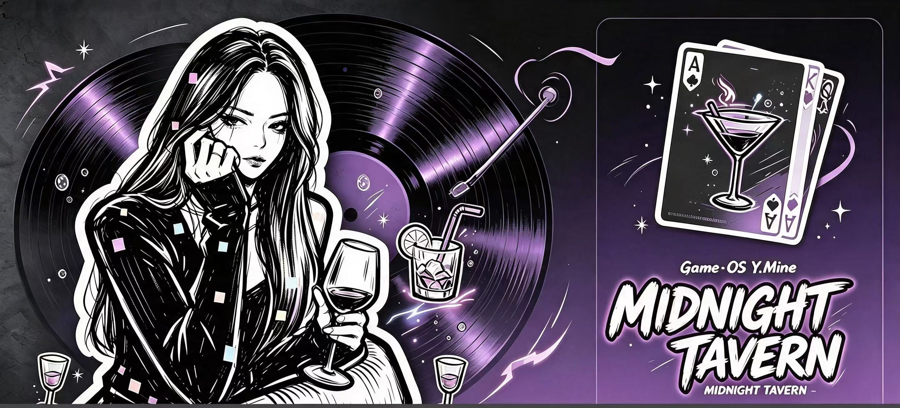

<div align="center">

# 🌃 MIDNIGHT TAVERN

### A Personality-Driven Entertainment Universe — Room V1 "Poker Egg" Now Open · MBTI × Kelly × Three-Layer AI

**The first public release (V1) of the Game-OS V2.5 Decision-AI Platform**

> **Read your opponent. Read yourself.**
>
> *Your fold rate knows you better than you do.*

[简体中文](./README.md) · **[English](./README_EN.md)**

[](https://github.com/HelloMInd-star/poker-egg-fullstack/releases)
[](https://opensource.org/licenses/MIT)
[](https://reactjs.org/)
[](https://fastapi.tiangolo.com/)
[](https://www.python.org/)
[](https://hellomind-star.github.io/poker-egg-fullstack/)
[](https://railway.app/)
[](./README.md)

> ⚠️ **Entertainment Only / This project is an AI behavior simulation demo. No real-money gambling involved.**
>
> All games use virtual chips. All behavioral data serves personality-modeling research only.

[🎮 Play Live](https://hellomind-star.github.io/poker-egg-fullstack/) · [📖 API Docs](https://poker-egg-fullstack-production.up.railway.app/docs) · [🧠 Three-Layer AI](#-three-layer-ai-architecture) · [🃏 Four Temperaments](#-four-temperaments-at-a-glance) · [🗺️ Roadmap](#️-roadmap)

</div>

---

## 🔮 What Is This

**MIDNIGHT TAVERN** is not a game demo — it is a growing **personality-driven entertainment universe**.

Every room runs on the same engine: **personality modeling + decision mathematics**. Poker, cocktails, music — just different costumes on the same core.

Push open the tavern door. The vinyl is spinning, neon glints off the glassware. The first room, **Poker Egg**, is already open — across the table sit not cold random-number AIs, but virtual opponents driven by **16 MBTI personalities**: NF Dreamers bait you with a 62%~66% bluff frequency; NT Analysts read the board with 87%~89% noise resistance; SJ Guardians build walls with a 72%~83% fold rate; SP Explorers hunt you with 66%~81% aggression.

Every all-in, every fold, every bluff you fall for is a mirror held up to your own decision-making. **It doesn't teach you to play cards. It teaches you to see yourself.**

### 🚪 Rooms in the Tavern

| Room | Status | One-liner |
|---|---|---|
| ♠️ **Poker Egg** | ✅ V1 live | An adversarial training ground against 16 MBTI personas |
| 🍸 **MBTI Mixology Bar** | 🧪 Beta (4-type preview on the in-app Tavern page) | Answer questions, get your pour — your personality picks your glass |
| 🎵 **Vinyl Jukebox** | 📋 Planned | Persona theme songs — every type gets its own BGM |

> Three rooms, one engine — **personality modeling + decision mathematics**, transferred across entertainment domains.

### Why It's Different

| Typical Poker AI | Poker Egg V1 |
|---|---|
| One difficulty slider for "smartness" | **Three-layer AI architecture**: decoupled Math / Persona / Performer layers |
| Random or rule-tree behavior, predictable style | **8-dim persona params × 12-dim behavior vectors** — 16 distinct playstyles, millisecond config switching, zero LLM latency |
| AI acts without explanation | **Persona-native decision rationale**: every AI move comes with an in-character "inner monologue" |
| Pot odds left to mental math | **Kelly Criterion optimal bet sizing** + Monte Carlo true equity, recomputed street by street |
| No warning when you bleed chips | **Game-OS risk-control layer**: three live thresholds (0.48 break-even / 0.50 steady / 0.68 circuit-breaker) |
| Cookie-cutter UI | **Immersive Midnight Tavern scene**: sticker-graffiti art, character seat avatars, tavern night ambience |

### Its Place in Game-OS

Midnight Tavern is the public showcase layer of the **Game-OS V2.5 Decision-AI Platform**, and Poker Egg is its first open room — it validates the platform's core hypothesis:

> **"Personality modeling + decision mathematics" transfers across domains.**
>
> Kelly sizing and noise resistance from financial risk control become EV calculation and hand-reading at the poker table;
> Personality profiling and emotion management from business negotiation become tilt control and bluff frequency in a hand.
>
> The same persona kernel can next be deployed to crypto trading, e-commerce pricing, esports drafts — or any adversarial arena you define.

---

## ✨ V1 Core Features

<div align="center">

| 🃏 **16 MBTI Opponents** | 📊 **Live Kelly Risk Panel** | 🔄 **Real-time WebSocket Play** |
|---|---|---|
| 8-dim persona params × 12-dim behavior vectors, config-driven in milliseconds, zero LLM latency | Monte Carlo true equity recomputed every street + hand-type recognition + Kelly optimal sizing + circuit-breaker alerts | Full WS pipeline for deal/bet/showdown, millisecond table sync |

| 🎭 **Persona Decision Rationale** | 🍸 **Midnight Tavern Scene** | 🧠 **Decoupled 3-Layer AI** |
|---|---|---|
| Every AI action ships with an in-character reason and tilt memory — lose to anyone, and know why | Tavern night ambience + sticker-graffiti table + character seat avatars + trial debrief | Math / Persona / Performer layers fully decoupled, independently replaceable |

| 📈 **Stats & Personality Profiling** | 🗂️ **Drawer-based Data Zone** | ⚡ **Zero-cost Deployment** |
|---|---|---|
| Win rate / fold rate / bluff-catch rate — your decisions expose your personality | Six-dim panel & hand info tucked into a side drawer; the stage belongs to the game | Docker-ready; runs free on GitHub Pages + Railway |

| 🕶️ **viewer_id Spectator Mask** | 📱 **Mobile @ 768px** | 🌐 **Backend Live in the Cloud** |
|---|---|---|
| Opponents' hole cards masked per viewer_id, revealed only at showdown | Responsive layout with a 768px breakpoint + full PWA, installable to home screen | Production backend on Railway; Swagger docs at `/docs` ready to explore |

</div>

---

## 🧠 Three-Layer AI Architecture

```
┌─────────────────────────────────────────────────────────────┐
│                     🎭  Performer Layer                       │
│   Optional LLM-driven persona lines / taunts / table drama   │
│   ─ disabled → pure behavioral persona, millisecond response │
├─────────────────────────────────────────────────────────────┤
│                     🎴  Persona Layer                         │
│   PersonaPokerMapper · 8-dim persona params × 12-dim model   │
│   ─ bluffFreq / tiltResist / noiseResist / aggrFactor       │
│   ─ foldFreq / callFreq / raiseFreq / positionBias ...      │
│   ─ in-character rationale + tilt memory (getting bluffed    │
│     repeatedly pushes a persona "on tilt")                   │
├─────────────────────────────────────────────────────────────┤
│                     📐  Mathematics Layer                     │
│   Kelly Criterion · Monte Carlo true equity · hand strength  │
│   ─ optimal bet fraction f* = (bp - q) / b                   │
│   ─ equity recomputed street by street (flop/turn/river),    │
│     no static lookup tables                                  │
│   ─ Game-OS risk thresholds: 0.48 / 0.50 / 0.68              │
└─────────────────────────────────────────────────────────────┘
                              │
                              ▼
                    🃏  Poker Game Engine
               (preflop → flop → turn → river → showdown)
```

| Layer | Responsibility | Core Module | Latency |
|---|---|---|---|
| 📐 Math | EV, Kelly sizing, hand strength | `ai/ai_engine.py` + NumPy | < 5ms |
| 🎴 Persona | Persona params, rationale, tilt memory | `ai/personality_engine.py` + `ai/personalities.py` | < 1ms (config lookup) |
| 🎭 Performer | Persona lines, emotional performance | Optional LLM (planned) | 200ms~2s (async) |

---

## 🃏 Four Temperaments at a Glance

<div align="center">

### 🔮 NF · The Dreamers · 诗意弈者

> INFP · INFJ · ENFP · ENFJ

**bluff 62%~66% · low tilt resistance · emotion-driven**

Mind-readers and storytellers. They narrate the hand as they play it — the highest bluff frequency in the house, not because the math says so, but because **they genuinely believe they'll win**. Beware the raise whose story is "too round"; but when the story collapses, nobody tilts faster.

---

### 🧪 NT · The Analysts · 算度大师

> INTP · INTJ · ENTP · ENTJ

**noiseResist 87%~89% · logic-first · emotionally insulated**

Cold probability machines. 87%+ noise resistance means your face, your cadence, your carefully acted "leak" — all filtered out. They see cards and odds only. Bluffing them is nearly useless; yet over-calculation makes them miss the "unreasonable but winning" spots.

---

### 🛡️ SJ · The Guardians · 阵地守将

> ISTJ · ISFJ · ESTJ · ESFJ

**fold 72%~83% · extremely tight · risk-averse**

Walls of steel. They fold seven or eight of every ten hands — but when they raise, believe them. You won't bluff chips out of a Guardian; you out-wait them until they make the mistake of "playing by the book when the book is wrong."

---

### ⚡ SP · The Explorers · 战术猎手

> ISTP · ISFP · ESTP · ESFP

**aggr 66%~81% · loose-aggressive · improvisational**

Beasts at the table. High aggression plus loose entries — they crush you with raise frequency and torment you with unpredictability. The most thrilling and dangerous seats in the house: they might shove 7-2 offsuit into you and actually win. Against Explorers, the Kelly panel is your life insurance.

</div>

---

## 🛠️ Tech Stack

### Frontend
| Tech | Purpose |
|---|---|
| **React 18 + Vite** | UI framework & build (millisecond HMR) |
| **Zustand** | Lightweight global state (live game data flow) |
| **Framer Motion** | Animation engine (deal/chip/flip motion) |
| **Ant Design 5** | UI component library |
| **Recharts** | Stats visualization |
| **Native WebSocket** | Real-time communication |
| **PWA** | manifest + Service Worker, installable |

### Backend
| Tech | Purpose |
|---|---|
| **FastAPI + Uvicorn** | Async web framework (single worker keeps in-memory state) |
| **WebSocket** | Real-time table communication |
| **NumPy** | Math layer (EV / Monte Carlo equity) |
| **PyJWT + python-jose** | JWT auth |
| **passlib + bcrypt** | Password hashing |
| **asyncpg** | Async PostgreSQL driver (auto-fallback to in-memory mode) |

### Deployment
| Platform | Purpose | Cost |
|---|---|---|
| **GitHub Pages + Actions** | Frontend hosting & CI (auto build & publish on push to main) | Free |
| **Railway** | Backend container + PostgreSQL | Free tier |
| **Docker** | Self-hosted containerization | — |

---

## 🚀 Run Locally

Prerequisites: Node.js ≥ 18, Python ≥ 3.11

```bash
# Clone
git clone https://github.com/HelloMInd-star/poker-egg-fullstack.git
cd poker-egg-fullstack

# ─── Backend ────────────────────────────
cd backend
cp .env.example .env              # edit DATABASE_URL / SECRET_KEY
pip install -r requirements.txt
uvicorn app:app --reload --port 5000
# Backend: http://localhost:5000 · API docs: http://localhost:5000/docs

# ─── Frontend (new terminal) ────────────
cd ../frontend
cp .env.example .env              # edit VITE_API_URL / VITE_WS_URL
npm install
npm run dev
# Frontend: http://localhost:5173
```

> 💡 **No database required**: without `DATABASE_URL`, the backend falls back to **in-memory mode** — any username/password logs in (e.g. `test` / `123456`); data resets on restart.
>
> ⚠️ **Single-worker constraint**: game state lives in process memory. Production must run `--workers 1`; multi-process breaks room consistency. Horizontal scaling requires Redis (planned).

---

## 🌐 Deployment

### Frontend · GitHub Pages (current setup)

1. This repo ships `.github/workflows/deploy.yml`: **pushing to main auto-builds and publishes** to GitHub Pages
2. Set Pages source to **GitHub Actions** — no manual config
3. The frontend adapts to the `/poker-egg-fullstack/` subpath via `import.meta.env.BASE_URL`
4. Pipeline takes ~3-5 min; site lives at `https://<username>.github.io/poker-egg-fullstack/`

### Backend · Railway (current setup)

1. Railway **New Project** → **Deploy from GitHub repo** → pick this repo
2. **Leave Root Directory empty** (uses the root `Dockerfile`)
3. Add PostgreSQL: **+ New** → **Database** → **Add PostgreSQL** — `DATABASE_URL` auto-injected
4. Set environment variables:

| Variable | Value | Note |
|---|---|---|
| `SECRET_KEY` | random string | Must change in production |
| `JWT_ALGORITHM` | `HS256` | JWT algorithm |
| `JWT_EXPIRE_MINUTES` | `10080` | Token TTL (7 days) |
| `ENVIRONMENT` | `production` | Environment flag |
| `CORS_ORIGINS` | your frontend origin | Comma-separated allowlist |
| `PORT` | — | Auto-injected by Railway |

5. After deploy, generate a public domain under **Settings → Networking** and feed it back into the frontend env vars
6. Health check: `/api/health` (configured in Dockerfile, 10s timeout)

**Current production instance**: <https://poker-egg-fullstack-production.up.railway.app> (Swagger docs at `/docs`)

> ⚠️ **Lesson learned**: a Railway **startCommand hardcoding `--port 5000` overrides the Dockerfile CMD**, breaking port/health-check alignment and failing deploys; fixed by moving the API to port **8080**. Keep any custom startCommand aligned with Railway's injected `PORT`.

---

## 📡 API Endpoints

With the backend running, visit `/docs` for Swagger UI or `/redoc` for ReDoc.

| Method | Path | Description |
|---|---|---|
| `GET` | `/` | Service info |
| `GET` | `/api/health` | Health check |
| `POST` | `/api/auth/register` | Register |
| `POST` | `/api/auth/login` | Login (form/json both supported) |
| `GET` | `/api/auth/me` | Current user |
| `POST` | `/api/game/create` | Create a game |
| `POST` | `/api/game/{id}/join` | Join a game |
| `POST` | `/api/game/{id}/start` | Start (deal) |
| `POST` | `/api/game/{id}/action` | Player action (fold / call / raise / all-in) |
| `POST` | `/api/game/{id}/ai/add` | Add an AI opponent |
| `GET` | `/api/game/{id}` | Game state |
| `GET` | `/api/stats/{playerId}` | Player stats |
| `WS` | `/ws/{game_id}` | WebSocket real-time channel |

---

## 📁 Project Structure

```
poker-egg-fullstack/
├── frontend/                        # React 18 + Vite frontend
│   ├── src/
│   │   ├── components/
│   │   │   ├── PokerTable/          # Table (elliptical seat layout/sticker graffiti/actions)
│   │   │   ├── MidnightTavern/      # Midnight Tavern home & ambience layer
│   │   │   ├── AnalysisPanel/       # Kelly panel (Monte Carlo equity per street)
│   │   │   ├── SideDrawer/          # Side drawer (six-dim panel / hand info)
│   │   │   ├── ResultModal/         # Trial debrief & result modals
│   │   │   ├── Dashboard/           # Dashboard (EV/Kelly/risk)
│   │   │   ├── GameLobby/           # Lobby (create/join rooms)
│   │   │   ├── Profile/             # Profile
│   │   │   └── Stats/               # Stats
│   │   ├── store/gameStore.js       # Zustand global state
│   │   ├── App.jsx / main.jsx
│   ├── public/
│   │   ├── characters/              # Character art (dealer/seat avatars/modal illustrations)
│   │   ├── stickers/                # Stickers (card back / chip stack)
│   │   ├── bg/                      # Tavern night background
│   │   └── manifest.json / sw.js    # PWA
│   ├── package.json / vite.config.js
│
├── backend/                         # FastAPI backend
│   ├── app.py                       # Entry (routes + WebSocket)
│   ├── services/game_engine.py      # Poker engine (deal/compare/street management)
│   ├── ai/
│   │   ├── ai_engine.py             # Math layer (EV/Kelly/Monte Carlo)
│   │   ├── personality_engine.py    # Persona engine (rationale + tilt memory)
│   │   ├── personalities.py         # PersonaPokerMapper · 16-type configs
│   │   └── analysis.py              # Behavioral analysis
│   ├── models/                      # DB connection (PG/in-memory fallback) + Pydantic schemas
│   ├── auth/auth.py                 # JWT auth
│   └── requirements.txt
│
├── .github/workflows/deploy.yml     # GitHub Actions frontend CI
├── Dockerfile                       # Root Dockerfile (for Railway)
├── railway.toml / docker-compose.yml / nginx/
├── github-poker-background.jpg      # README cover · Midnight Tavern key visual
├── LICENSE
└── README.md / README_EN.md
```

---

## 🗺️ Roadmap

### ✅ V1.0 "Poker Egg" (2026-08, current)
- [x] Full Texas Hold'em flow: preflop → flop → turn → river → showdown
- [x] Real-time WebSocket table + adaptive elliptical seat layout
- [x] **16-persona opponent engine**: 8-dim persona params + in-character rationale + tilt memory — all four temperament groups live (NT 算度大师 / NF 诗意弈者 / SJ 阵地守将 / SP 战术猎手)
- [x] **Live Kelly risk panel**: Monte Carlo true equity per street + hand-type recognition + AnalysisPanel frontend + three circuit-breakers (0.48 / 0.50 / 0.68)
- [x] **Immersive Midnight Tavern scene**: tavern ambience layer + sticker-graffiti table + character seat avatars + card-back/chip stickers
- [x] Trial debrief modals + drawer-based data zone (six-dim / hand info)
- [x] **Spectator-view masking**: viewer_id masks opponents' hole cards (masked over HTTP polling, revealed on hand_over; WS broadcast unchanged)
- [x] **Mobile adaptation**: responsive 768px breakpoint + full PWA capability
- [x] JWT user system + stats + PWA
- [x] Zero-cost pipeline: GitHub Pages + Railway (production backend live)

### 🎯 V1.1 (in progress)
- [ ] 16 persona cocktail-card visual set (crossover with the Y.Mine mixology line)
- [ ] Opponent picker (choose MBTI types to seat)
- [ ] Post-game decision-personality report (generated from your action sequence)
- [ ] 🍸 Full 16-type MBTI Mixology Bar (current in-app Beta covers four types)
- [ ] 🎵 Vinyl Jukebox (persona theme songs, crossover with the Y.Mine music line)

### 🔮 V2 (planned)
- [ ] 🎭 LLM Performer layer (persona lines/taunts/emotion, async & non-blocking)
- [ ] Redis external state store (horizontal scaling)
- [ ] Persona matchmaking (matches you with the opponent who "counters you hardest")
- [ ] Tournament modes (MTT / SNG)
- [ ] Game-OS platformization: persona kernel exported across domains (finance/e-commerce/esports)
- [ ] Reinforcement-learning layer (persona + RL adaptive evolution)

---

## 🤝 Contributing

PRs, issues, and persona-tuning suggestions are all welcome.

1. Fork the repo
2. Create a feature branch: `git checkout -b feature/your-feature`
3. Commit: `git commit -m 'feat: add your feature'`
4. Push: `git push origin feature/your-feature`
5. Open a Pull Request

Battle-tested tuning suggestions for persona params (bluffFreq / aggrFactor etc.) are especially welcome — **the behavior vectors of 16 personalities need massive hand-history calibration**.

---

## 📄 License

[MIT License](LICENSE)

---

## 👨‍💻 Author

**Hello.Mind-star (Y.MINE)** · Game-OS V2.5 Architect

- GitHub: [@HelloMInd-star](https://github.com/HelloMInd-star)
- Project: [https://github.com/HelloMInd-star/poker-egg-fullstack](https://github.com/HelloMInd-star/poker-egg-fullstack)

---

<div align="center">

**♠️♥️♦️♣️**

*"The cards don't lie. But the people holding them do."*

⚠️ **Entertainment Only / AI behavior simulation demo. No real-money gambling.**

If you saw yourself at this table — that's why this project exists. ⭐

</div>
